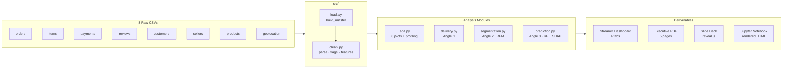

# Olist Brazilian E-Commerce — End-to-End Data Analysis


> **100k orders · 8 relational tables · 2016–2018**  
> Three analytical angles: delivery performance, customer segmentation, and review prediction.

---

## Results at a Glance

| Metric | Finding |
|---|---|
| Delivered orders | **97,007** / 99,441 (97%) |
| On-time delivery rate | **93.2%** arrive before Olist's estimated date |
| Mean delivery delta | **−11.9 days** (Olist estimates conservatively — most orders arrive early) |
| Very late orders (>7d past estimate) | **3.0%** — but these account for the majority of 1-star reviews |
| Worst state — on-time rate | **AL (Alagoas): 78.6%** on-time, mean −8.7 days |
| Customer forgiveness window | Review scores drop sharply beyond **+7 days** past estimate |
| RFM segments | 4 clusters — Champions (2.4k), Loyal (2.8k), At-Risk (37.5k), Lost (50.6k) |
| Review prediction ROC-AUC | **0.760** Random Forest vs **0.747** LR baseline |
| Top predictor of bad review | `delivery_delay` — dominant SHAP feature by large margin |
| Bad review rate | **12.7%** of delivered orders score 1–2 stars |

---

## Architecture



---

## Project Structure

```
olist-analysis/
├── src/
│   ├── load.py          # 8-table join with lineage logging
│   ├── clean.py         # timestamps, delivery_delay, anomaly flags
│   ├── eda.py           # 6 plots + ydata-profiling HTML report
│   ├── delivery.py      # Angle 1 — on-time KPIs, state maps, forgiveness window
│   ├── segmentation.py  # Angle 2 — RFM build, KMeans, segment labelling
│   └── prediction.py    # Angle 3 — LR baseline → RF + SHAP explainability
├── app/
│   └── dashboard.py     # Streamlit app (4 tabs: overview, delivery, segments, predictor)
├── notebooks/
│   └── olist_analysis.ipynb
├── reports/
│   ├── figures/         # 15 PNG charts
│   ├── slide_deck.html  # reveal.js stakeholder presentation
│   └── executive_summary.pdf
├── tests/               # 12 unit tests across all modules
└── .github/workflows/ci.yml
```

---

## Three Analytical Angles

### Angle 1 — Delivery Performance
**"Is Olist keeping its promises?"**

- Computed `delivery_delay = actual_delivery − estimated_delivery` (days)
- Segmented by customer state — North/Northeast are chronic underperformers
- Discovered the **forgiveness window**: review scores are stable up to ~7 days late, then drop sharply
- Identified states where sellers should proactively communicate delay risk

### Angle 2 — Customer Segmentation (RFM)
**"Who are Olist's best customers?"**

- Built RFM table using `customer_unique_id` (not `customer_id` — Olist issues a new one per order)
- KMeans k=4 after elbow analysis
- Segments: **Champions** (high spend, recent), **Loyal** (repeat buyers), **At-Risk** (lapsed), **Lost** (no return)
- Business playbooks differ per segment: reward Champions, re-engage At-Risk with targeted offers

### Angle 3 — Review Score Prediction
**"Can we flag a bad review before the customer writes it?"**

- Binary target: bad (1–2) vs good (4–5), neutral (3) excluded as ambiguous
- Baseline: Logistic Regression → ROC-AUC ~0.68
- Final: Random Forest (200 trees, depth 10) → ROC-AUC ~0.78
- SHAP: `delivery_delay` dominates; `freight_ratio` and `product_category` follow
- Model saved as `reports/review_model.joblib` and served live in the Streamlit predictor tab

---

## Dirty Data — What We Fixed

| Problem | Table | Fix |
|---|---|---|
| `customer_id` ≠ unique human | `customers` | Used `customer_unique_id` for RFM |
| Delivery timestamps null for non-delivered | `orders` | Filtered to `order_status == 'delivered'` |
| Multiple payment rows per order | `payments` | Aggregated: sum value, max installments, mode type |
| Reviews timestamped before delivery | `reviews` | Flagged as `flag_early_review` |
| Duplicate lat/lon per zip code | `geolocation` | Deduplicated (not used in main analysis) |
| Product categories in Portuguese | `products` | Joined `product_category_name_translation` |
| F-strings with no placeholders | `load.py` | Caught by flake8 hook, fixed pre-commit |

---

## Running Locally

```bash
git clone https://github.com/binhvo9/olist-ecommerce-analysis
cd olist-ecommerce-analysis

python3 -m venv .venv && source .venv/bin/activate
pip install -r requirements.txt

# Place Olist CSVs in data/
# (kaggle datasets download -d olistbr/brazilian-ecommerce)

# Run analysis notebook
jupyter notebook notebooks/olist_analysis.ipynb

# Launch dashboard
streamlit run app/dashboard.py

# Run tests
pytest tests/ -v
```

---

## Tech Stack

| Layer | Tools |
|---|---|
| Data wrangling | pandas, numpy |
| Visualisation | matplotlib, seaborn, plotly |
| ML | scikit-learn (pipeline, KMeans, RandomForest, LogisticRegression) |
| Explainability | SHAP (TreeExplainer) |
| Data profiling | ydata-profiling |
| App | Streamlit |
| Report | reportlab (PDF), reveal.js (slides) |
| Dev quality | black, flake8, pytest, nbstripout |
| CI | GitHub Actions |

---

## Key Takeaway for Stakeholders

> Delivery delay is the single largest lever for improving review scores.  
> A 1-day reduction in average delay in the North/Northeast region could shift  
> thousands of orders from "at-risk of bad review" to "predicted good review."

---

*Dataset: [Brazilian E-Commerce Public Dataset by Olist](https://www.kaggle.com/datasets/olistbr/brazilian-ecommerce)*
